```
██╗  ██╗ ██╗██████╗     ███████╗██████╗ ██╗
╚██╗██╔╝███║╚════██╗    ██╔════╝██╔══██╗██║
 ╚███╔╝ ╚██║ █████╔╝    █████╗  ██║  ██║██║
 ██╔██╗  ██║██╔═══╝     ██╔══╝  ██║  ██║██║
██╔╝ ██╗ ██║███████╗    ███████╗██████╔╝██║
╚═╝  ╚═╝ ╚═╝╚══════╝    ╚══════╝╚═════╝ ╚═╝
        P Y T H O N   T O O L K I T
```

<div align="center">

[](https://github.com/copyleftdev/x12-python/actions/workflows/ci.yml)
[](https://github.com/copyleftdev/x12-python)
[](https://www.python.org/)
[](LICENSE)

**The ultimate Python toolkit for X12 EDI processing**

*Parse, validate, and generate healthcare & supply chain transactions with HIPAA compliance*

</div>

---

## Architecture

```mermaid
flowchart TB
    subgraph Input["📄 Input"]
        EDI[("EDI File\n837/835/850...")]
    end

    subgraph Core["⚙️ Core Engine"]
        direction TB
        TOK[Tokenizer] --> PARSE[Parser]
        PARSE --> LOOP[Loop Builder]
        LOOP --> VAL[Validator]
    end

    subgraph Schema["📋 Schema & Codes"]
        direction TB
        SCH[(Transaction\nSchemas)]
        CODE[(Code\nSets)]
    end

    subgraph Output["📤 Output"]
        direction TB
        MODEL[Pydantic Models]
        ACK[997/999 Acks]
        GEN[EDI Generator]
    end

    EDI --> TOK
    SCH -.-> VAL
    CODE -.-> VAL
    VAL --> MODEL
    MODEL --> ACK
    MODEL --> GEN

    style Input fill:#e1f5fe
    style Core fill:#fff3e0
    style Schema fill:#f3e5f5
    style Output fill:#e8f5e9
```



## Features

- **Parsing** - Parse X12 EDI documents with automatic delimiter detection
- **Validation** - Multi-level validation with HIPAA compliance checks
- **Generation** - Generate properly formatted X12 EDI output
- **Streaming** - Memory-bounded streaming for large files
- **Acknowledgments** - Generate 997/999 functional acknowledgments
- **Schema Support** - Schema-based validation for 837, 835, 270/271, 850
- **Code Validation** - NPI, Tax ID, ICD-10, CPT/HCPCS validation
- **Trading Partners** - Partner configuration management

## Installation

```bash
pip install x12-python
```

Or install from source:

```bash
git clone https://github.com/copyleftdev/x12-python.git
cd x12-python
pip install -e .
```

## Quick Start

### Parse an EDI File

```python
from x12.core.parser import Parser

# Parse EDI content
parser = Parser()
interchange = parser.parse(edi_content)

# Access parsed data
print(f"Sender: {interchange.sender_id}")
print(f"Receiver: {interchange.receiver_id}")

for group in interchange.functional_groups:
    for transaction in group.transaction_sets:
        print(f"Transaction: {transaction.transaction_set_id}")
```

### Validate a Transaction

```python
from x12.core.validator import X12Validator

validator = X12Validator()
report = validator.validate(interchange)

if report.is_valid:
    print("Document is valid!")
else:
    for error in report.errors:
        print(f"Error: {error}")
```

### Generate EDI Output

```python
from x12.core.generator import Generator
from x12.models import Segment, Element

generator = Generator()

# Generate a segment
segment = Segment(
    segment_id="NM1",
    elements=[
        Element(value="85", index=1),
        Element(value="2", index=2),
        Element(value="ACME HOSPITAL", index=3),
    ]
)

edi_output = generator.generate(segment)
# Output: NM1*85*2*ACME HOSPITAL~
```

### Stream Large Files

```python
from x12.streaming import StreamingSegmentReader

# Process large files with bounded memory
with open("large_file.edi") as f:
    reader = StreamingSegmentReader(f)
    for segment in reader.segments():
        process(segment)
```

### Generate Acknowledgments

```python
from x12.acknowledgments import AcknowledgmentGenerator

generator = AcknowledgmentGenerator(
    sender_id="RECEIVER",
    receiver_id="SENDER",
)

# Generate 997 acknowledgment
ack = generator.generate_997(functional_group)
```

## Supported Transactions

### Healthcare (HIPAA 5010)

| Transaction | Version | Description |
|-------------|---------|-------------|
| 837P | 005010X222A1 | Health Care Claim: Professional |
| 837I | 005010X223A3 | Health Care Claim: Institutional |
| 837D | 005010X224A3 | Health Care Claim: Dental |
| 835 | 005010X221A1 | Health Care Claim Payment/Advice |
| 270/271 | 005010X279A1 | Eligibility Benefit Inquiry/Response |
| 276/277 | 005010X212 | Claim Status Request/Response |
| 834 | 005010X220A1 | Benefit Enrollment and Maintenance |
| 278 | 005010X217 | Health Care Services Review (Prior Auth) |
| 820 | 005010X218 | Premium Payment |

### Supply Chain (4010)

| Transaction | Description |
|-------------|-------------|
| 850 | Purchase Order |
| 855 | Purchase Order Acknowledgment |
| 856 | Ship Notice/Manifest (ASN) |
| 860 | Purchase Order Change |
| 810 | Invoice |

## Project Structure

```
x12/
├── core/           # Parser, validator, generator, tokenizer
├── models/         # Segment, Element, Loop, Envelope models
├── schema/         # Schema definitions and loader
├── codes/          # Code set registry and validators
├── streaming/      # Memory-bounded streaming reader
├── acknowledgments/# 997/999 acknowledgment generation
├── trading_partners/ # Partner configuration
└── transactions/   # Transaction-specific models
    ├── healthcare/ # 837, 835, 270/271 models
    └── supply_chain/ # 850, 856, 810 models
```

## Testing

```bash
# Run all tests
pytest tests/

# Run with coverage
pytest tests/ --cov=x12 --cov-report=term-missing

# Run specific test types
pytest tests/unit -v
pytest tests/integration -v
pytest tests/property -v
pytest tests/compliance -v
pytest tests/performance -v
```

## Code Quality

```bash
# Type checking
mypy x12 --strict

# Linting
ruff check .
ruff format .
```

## Development

This project follows **Test-Driven Development (TDD)**:

1. Write failing tests first (RED)
2. Implement minimal code to pass (GREEN)
3. Refactor while keeping tests green (REFACTOR)

## Contributing

We welcome contributions! Please see [CONTRIBUTING.md](CONTRIBUTING.md) for guidelines.

Quick start:

```bash
# Clone and setup
git clone https://github.com/donjohnson/x12-edi-tools.git
cd x12-edi-tools
python -m venv .venv
source .venv/bin/activate
pip install -e ".[dev]"

# Run tests
pytest tests/
```

## API Reference

### Core Classes

- `Parser` - Parse EDI content into structured objects
- `Generator` - Generate EDI output from objects
- `X12Validator` - Validate EDI documents
- `Tokenizer` - Low-level EDI tokenization
- `Delimiters` - Delimiter detection and configuration

### Models

- `Segment` - X12 segment with elements
- `Element` - Individual data element
- `Loop` - Hierarchical loop structure
- `Interchange` - ISA/IEA envelope
- `FunctionalGroup` - GS/GE envelope
- `TransactionSet` - ST/SE envelope

### Schema

- `SchemaLoader` - Load schema definitions
- `TransactionSchema` - Complete transaction schema
- `SegmentDefinition` - Segment structure definition
- `ElementDefinition` - Element validation rules

### Codes

- `CodeRegistry` - Registry of code sets
- `CodeSet` - Set of valid codes with descriptions
- `validate_npi()` - NPI validation with Luhn check
- `validate_tax_id()` - EIN validation
- `validate_diagnosis_code()` - ICD-10 format validation
- `validate_procedure_code()` - CPT/HCPCS validation

### Trading Partners

- `TradingPartner` - Partner configuration
- `PartnerRegistry` - Partner management
- `ContactInfo` - Contact information

## Changelog

See [CHANGELOG.md](CHANGELOG.md) for version history and release notes.

## License

MIT License - see [LICENSE](LICENSE) for details.

Copyright (c) 2024 Don Johnson

## Acknowledgments

Built following X12 standards from ASC X12 and HIPAA implementation guides.
